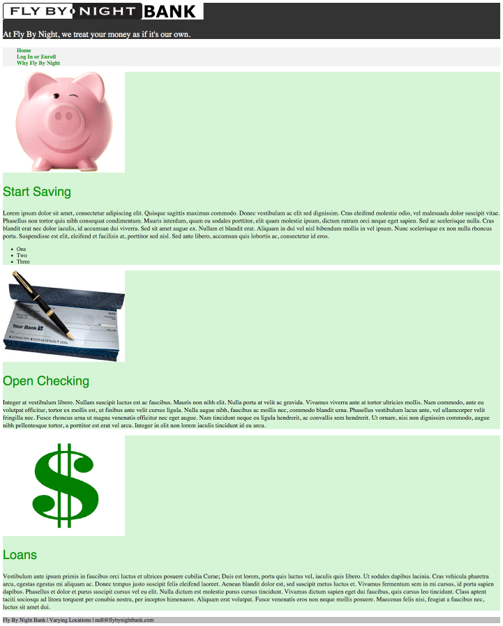
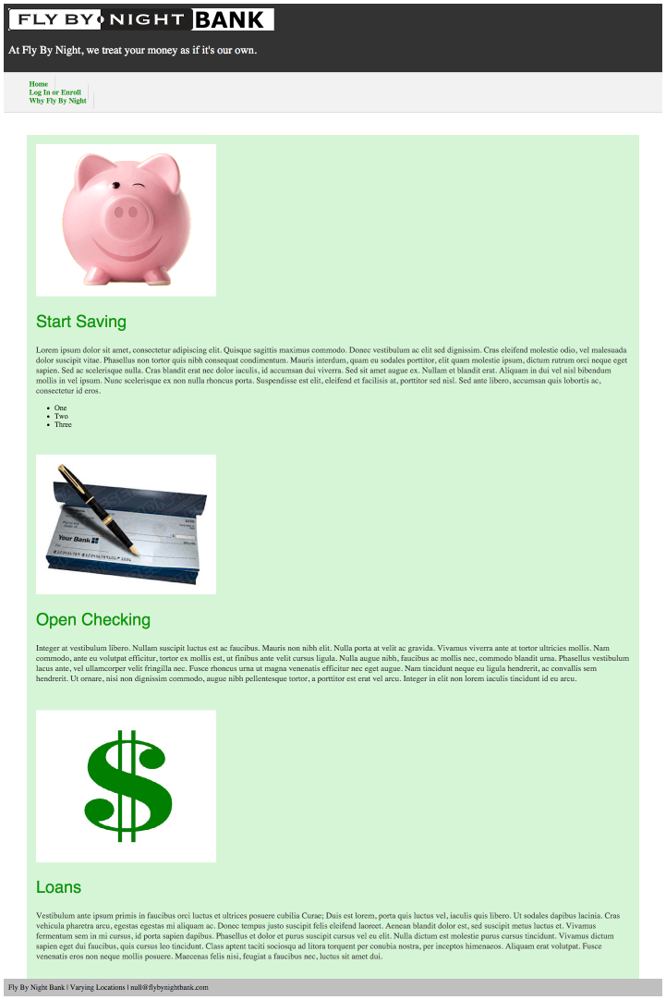
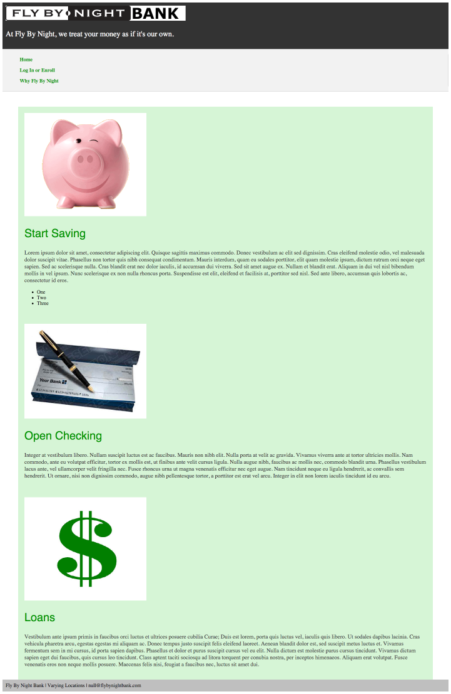
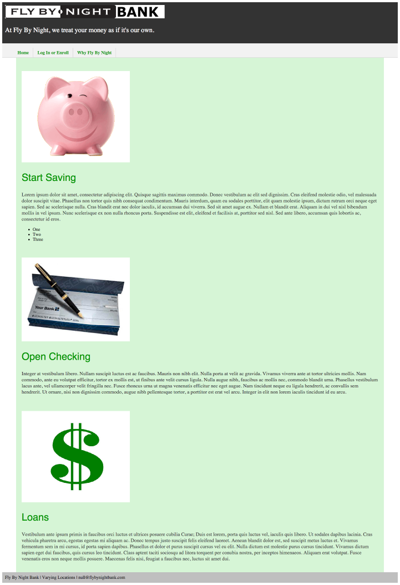
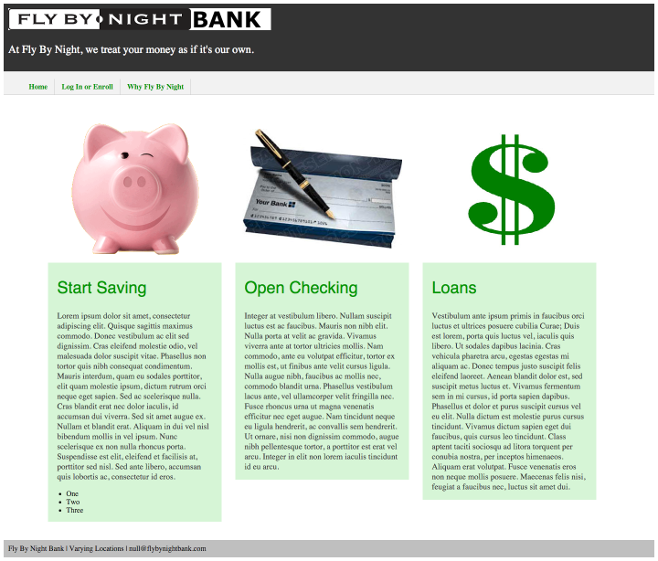

# Fly By Night Bank
Create a web page that matches the screenshots below using HTML and CSS.

## Step 1

## Step 2

## Step 3

## Step 4

## Step 5

The following colors are used for the exercises:
- #333333  (header background)
- #f2f2f2  (nav background)
- #009900  (nav links)
- #d6f5d6  (account text)
- #009900  (account headings)
- #bfbfbf  (footer background)